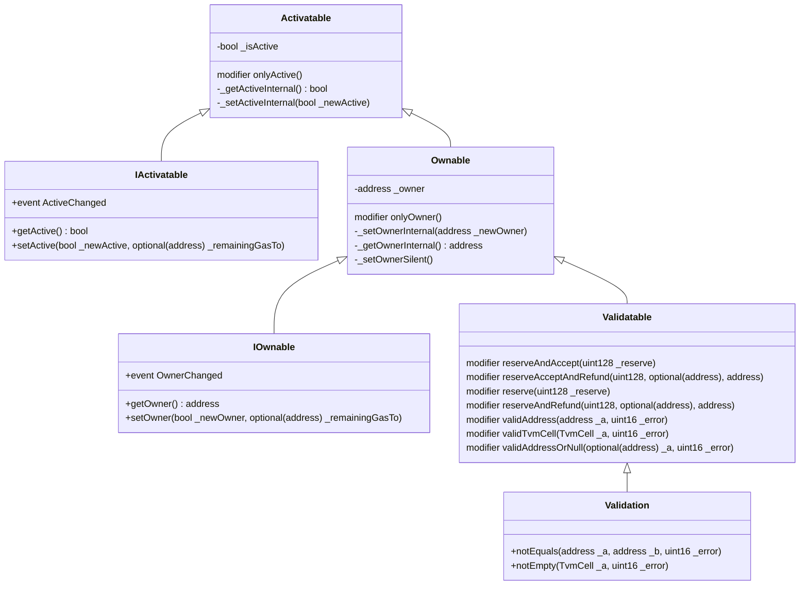
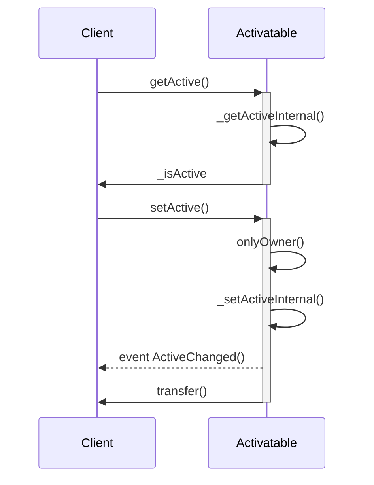

### Activatable

```mermaid
classDiagram
    Activatable <|-- IActivatable
    Activatable <|-- Ownable
    Ownable <|-- IOwnable
    Ownable <|-- Validatable
    Validatable <|-- Validation
    
    class Activatable {
        -bool _isActive
        modifier onlyActive()
        -_getActiveInternal() bool
        -_setActiveInternal(bool _newActive)
    }
    
    class Ownable {
        -address _owner
        modifier onlyOwner()
        -_setOwnerInternal(address _newOwner)
        -_getOwnerInternal() address
        -_setOwnerSilent()
    }
    
    class IActivatable {
      +event ActiveChanged
      +getActive() bool
      +setActive(bool _newActive, optional(address) _remainingGasTo)
    }
    
    class IOwnable {
        +event OwnerChanged
        +getOwner() address
        +setOwner(bool _newOwner, optional(address) _remainingGasTo)
    }
    
    class Validatable {
        modifier reserveAndAccept(uint128 _reserve)
        modifier reserveAcceptAndRefund(uint128, optional(address), address)
        modifier reserve(uint128 _reserve)
        modifier reserveAndRefund(uint128, optional(address), address)
        modifier validAddress(address _a, uint16 _error)
        modifier validTvmCell(TvmCell _a, uint16 _error)
        modifier validAddressOrNull(optional(address) _a, uint16 _error)
    }

    class Validation {
        +notEquals(address _a, address _b, uint16 _error)
        +notEmpty(TvmCell _a, uint16 _error)
    }
```

```mermaid
sequenceDiagram
    Client->>+Activatable: getActive()
    Activatable->>Activatable: _getActiveInternal()
    Activatable->>-Client: _isActive

    Client->>+Activatable: setActive()
    Activatable->>Activatable: onlyOwner()
    Activatable->>Activatable: _setActiveInternal()
    Activatable-->>Client: event ActiveChanged()
    Activatable->>-Client: transfer()
```
