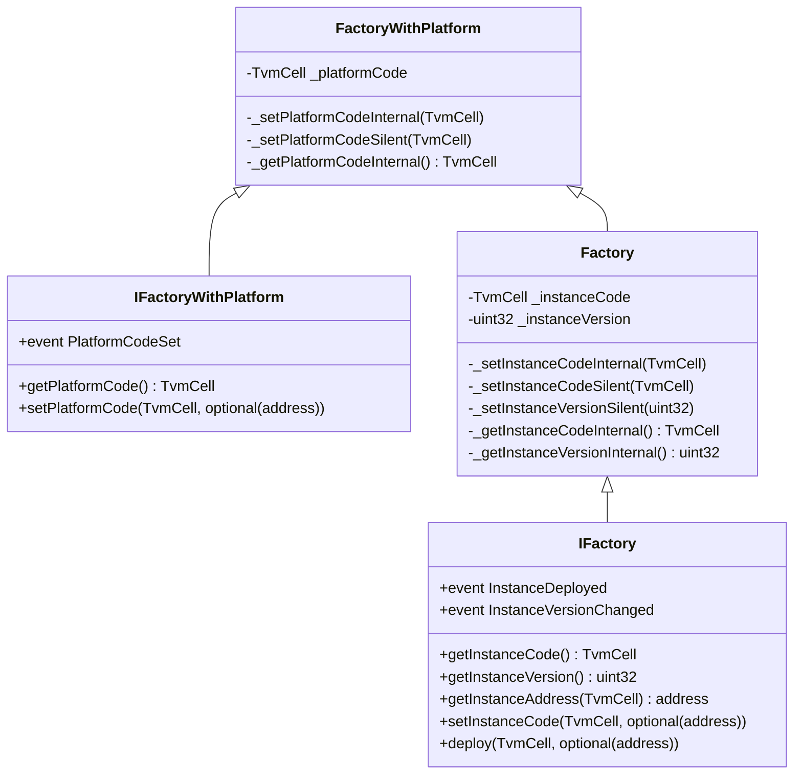
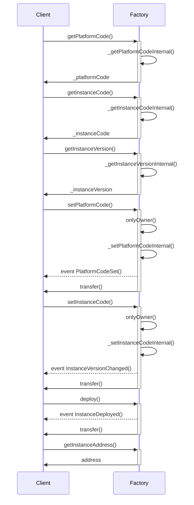

### FactoryWithPlatform

```mermaid
classDiagram
    FactoryWithPlatform <|-- IFactoryWithPlatform
    FactoryWithPlatform <|-- Factory
    Factory <|-- IFactory
    
    class FactoryWithPlatform {
        -TvmCell _platformCode
        
        -_setPlatformCodeInternal(TvmCell)
        -_setPlatformCodeSilent(TvmCell)
        -_getPlatformCodeInternal() TvmCell
    }
    
    class Factory {
        -TvmCell _instanceCode
        -uint32 _instanceVersion
        
        -_setInstanceCodeInternal(TvmCell)
        -_setInstanceCodeSilent(TvmCell)
        -_setInstanceVersionSilent(uint32)
        -_getInstanceCodeInternal() TvmCell
        -_getInstanceVersionInternal() uint32  
    }

    class IFactory {
        +event InstanceDeployed
        +event InstanceVersionChanged
        
        +getInstanceCode() TvmCell
        +getInstanceVersion() uint32
        +getInstanceAddress(TvmCell) address
        +setInstanceCode(TvmCell, optional(address))
        +deploy(TvmCell, optional(address))
    }
    
    class IFactoryWithPlatform {
        +event PlatformCodeSet
        
        +getPlatformCode() TvmCell
        +setPlatformCode(TvmCell, optional(address))
    }
```

```mermaid
sequenceDiagram
    Client->>+Factory: getPlatformCode()
    Factory->>Factory: _getPlatformCodeInternal()
    Factory->>-Client: _platformCode

    Client->>+Factory: getInstanceCode()
    Factory->>Factory: _getInstanceCodeInternal()
    Factory->>-Client: _instanceCode

    Client->>+Factory: getInstanceVersion()
    Factory->>Factory: _getInstanceVersionInternal()
    Factory->>-Client: _instanceVersion

    Client->>+Factory: setPlatformCode()
    Factory->>Factory: onlyOwner()
    Factory->>Factory: _setPlatformCodeInternal()
    Factory-->>Client: event PlatformCodeSet()
    Factory->>-Client: transfer()

    Client->>+Factory: setInstanceCode()
    Factory->>Factory: onlyOwner()
    Factory->>Factory: _setInstanceCodeInternal()
    Factory-->>Client: event InstanceVersionChanged()
    Factory->>-Client: transfer()

    Client->>+Factory: deploy()
    Factory-->>Client: event InstanceDeployed()
    Factory->>-Client: transfer()

    Client->>+Factory: getInstanceAddress()
    Factory->>-Client: address
```
