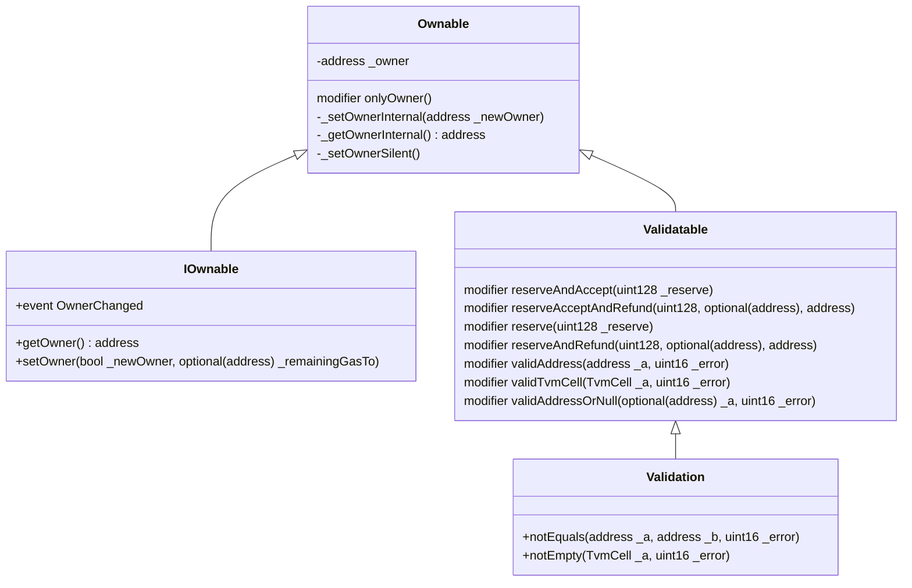
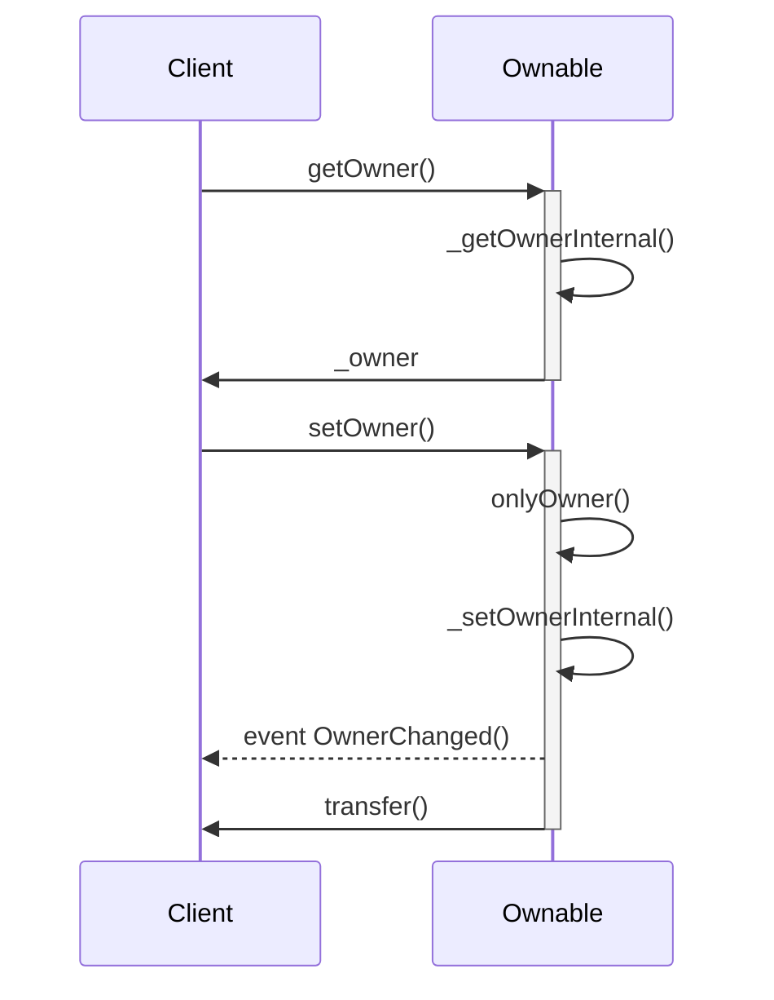

### Ownable

```mermaid
classDiagram
    Ownable <|-- IOwnable
    Ownable <|-- Validatable
    Validatable <|-- Validation
    
    class Ownable {
        -address _owner
        modifier onlyOwner()
        -_setOwnerInternal(address _newOwner)
        -_getOwnerInternal() address
        -_setOwnerSilent()
    }
    
    class IOwnable {
        +event OwnerChanged
        +getOwner() address
        +setOwner(bool _newOwner, optional(address) _remainingGasTo)
    }
    
    class Validatable {
        modifier reserveAndAccept(uint128 _reserve)
        modifier reserveAcceptAndRefund(uint128, optional(address), address)
        modifier reserve(uint128 _reserve)
        modifier reserveAndRefund(uint128, optional(address), address)
        modifier validAddress(address _a, uint16 _error)
        modifier validTvmCell(TvmCell _a, uint16 _error)
        modifier validAddressOrNull(optional(address) _a, uint16 _error)
    }

    class Validation {
        +notEquals(address _a, address _b, uint16 _error)
        +notEmpty(TvmCell _a, uint16 _error)
    }
```

```mermaid
sequenceDiagram
    Client->>+Ownable: getOwner()
    Ownable->>Ownable: _getOwnerInternal()
    Ownable->>-Client: _owner

    Client->>+Ownable: setOwner()
    Ownable->>Ownable: onlyOwner()
    Ownable->>Ownable: _setOwnerInternal()
    Ownable-->>Client: event OwnerChanged()
    Ownable->>-Client: transfer()
```
