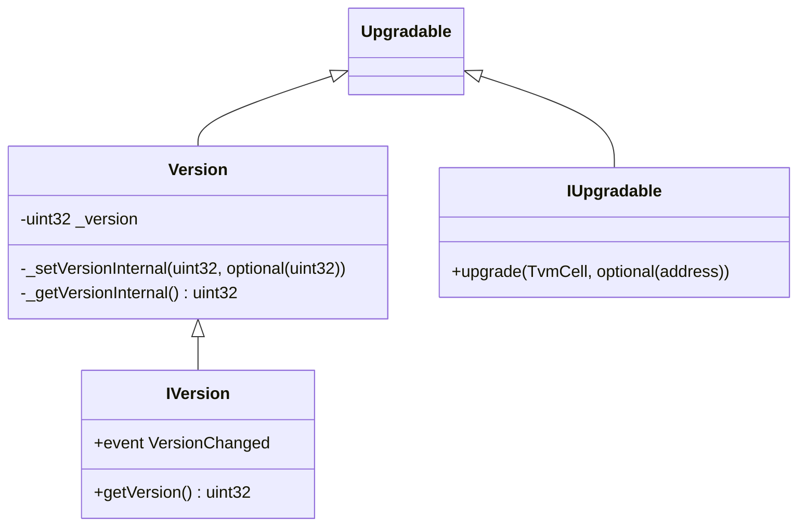
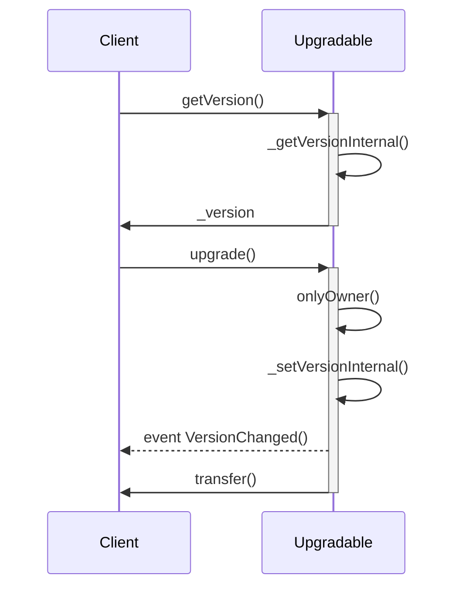

### Upgradable

```mermaid
classDiagram
    Version <|-- IVersion
    Upgradable <|-- Version
    Upgradable <|-- IUpgradable
    
    class Upgradable {

    }
    
    class Version {
        -uint32 _version
        -_setVersionInternal(uint32, optional(uint32))
        -_getVersionInternal() uint32
    }

    class IUpgradable {
        +upgrade(TvmCell, optional(address))
    }
    
    class IVersion {
        +event VersionChanged
        +getVersion() uint32
    }
```

```mermaid
sequenceDiagram
    Client->>+Upgradable: getVersion()
    Upgradable->>Upgradable: _getVersionInternal()
    Upgradable->>-Client: _version
    
    Client->>+Upgradable: upgrade()
    Upgradable->>Upgradable: onlyOwner()
    Upgradable->>Upgradable: _setVersionInternal()
    Upgradable-->>Client: event VersionChanged()
    Upgradable->>-Client: transfer()
```
