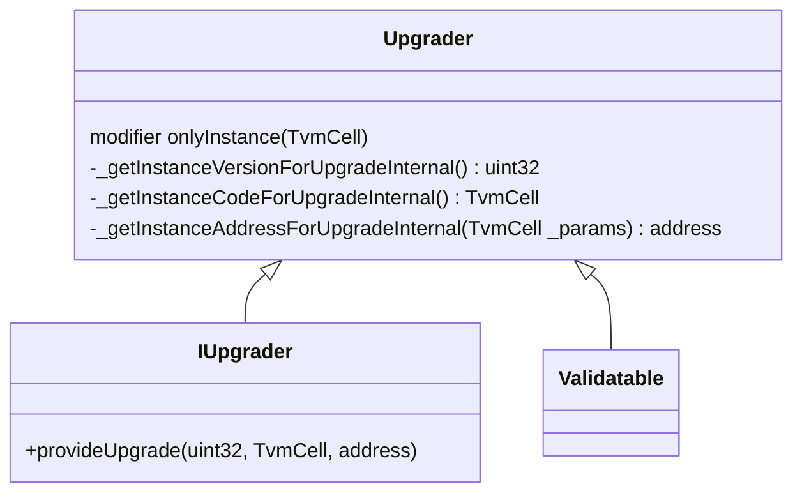
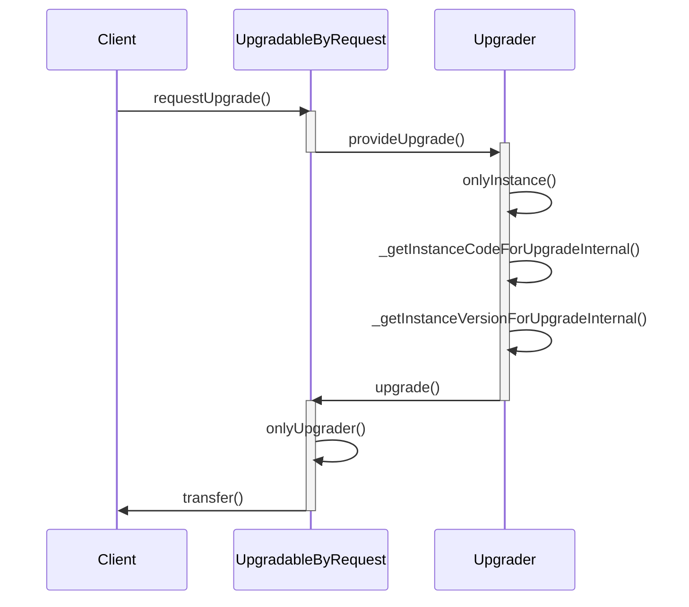

### Upgrader

```mermaid
classDiagram
    Upgrader <|-- IUpgrader
    Upgrader <|-- Validatable
    
    class Upgrader {
        modifier onlyInstance(TvmCell)
        -_getInstanceVersionForUpgradeInternal() uint32
        -_getInstanceCodeForUpgradeInternal() TvmCell
        -_getInstanceAddressForUpgradeInternal(TvmCell _params) address
    }

    class IUpgrader {
        +provideUpgrade(uint32, TvmCell, address)
    }
```

```mermaid
sequenceDiagram
    Client->>UpgradableByRequest: requestUpgrade()
    activate UpgradableByRequest
    UpgradableByRequest->>+Upgrader: provideUpgrade()
    deactivate UpgradableByRequest

    Upgrader->>Upgrader: onlyInstance()
    Upgrader->>Upgrader: _getInstanceCodeForUpgradeInternal()
    Upgrader->>Upgrader: _getInstanceVersionForUpgradeInternal()
    Upgrader->>-UpgradableByRequest: upgrade()

    activate UpgradableByRequest
    UpgradableByRequest ->> UpgradableByRequest: onlyUpgrader()
    UpgradableByRequest ->> Client: transfer()
    deactivate UpgradableByRequest
```
