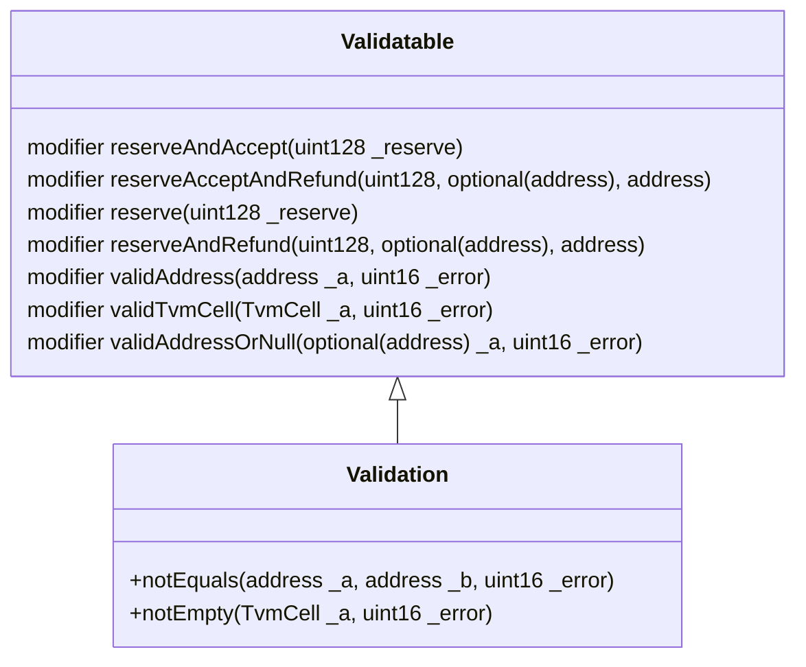

### Validatable

```mermaid
classDiagram
    Validatable <|-- Validation

    class Validatable {
        modifier reserveAndAccept(uint128 _reserve)
        modifier reserveAcceptAndRefund(uint128, optional(address), address)
        modifier reserve(uint128 _reserve)
        modifier reserveAndRefund(uint128, optional(address), address)
        modifier validAddress(address _a, uint16 _error)
        modifier validTvmCell(TvmCell _a, uint16 _error)
        modifier validAddressOrNull(optional(address) _a, uint16 _error)
    }

    class Validation {
        +notEquals(address _a, address _b, uint16 _error)
        +notEmpty(TvmCell _a, uint16 _error)
    }
```
