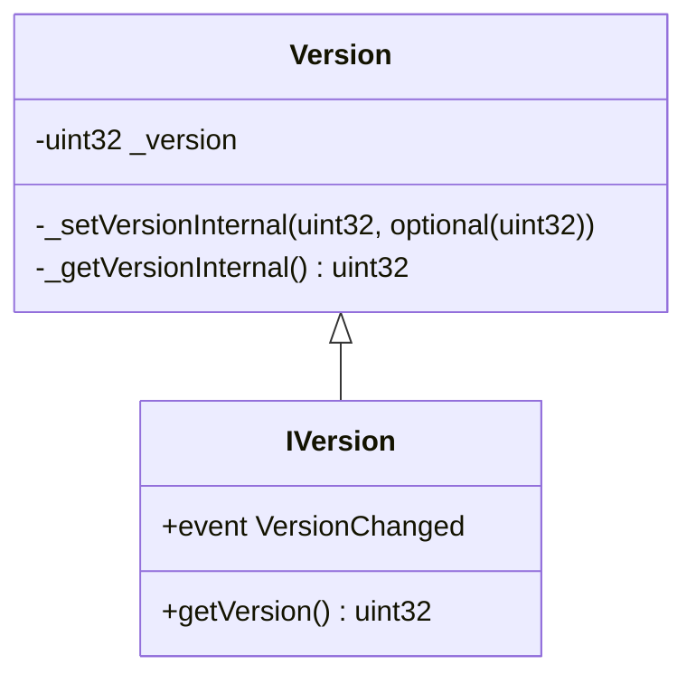
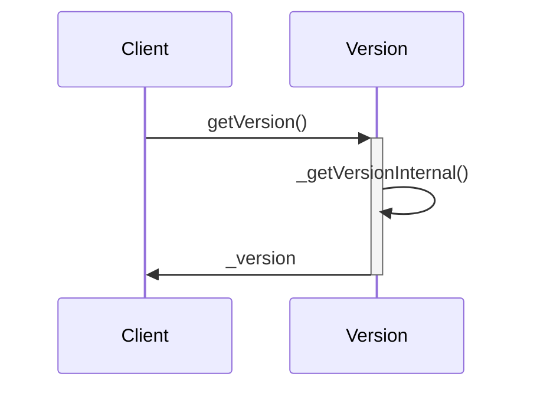

### Version

```mermaid
classDiagram
    Version <|-- IVersion
    
    class Version {
        -uint32 _version
        -_setVersionInternal(uint32, optional(uint32))
        -_getVersionInternal() uint32
    }

    class IVersion {
        +event VersionChanged
        +getVersion() uint32
    }
```

```mermaid
sequenceDiagram
    Client->>+Version: getVersion()
    Version->>Version: _getVersionInternal()
    Version->>-Client: _version
```
